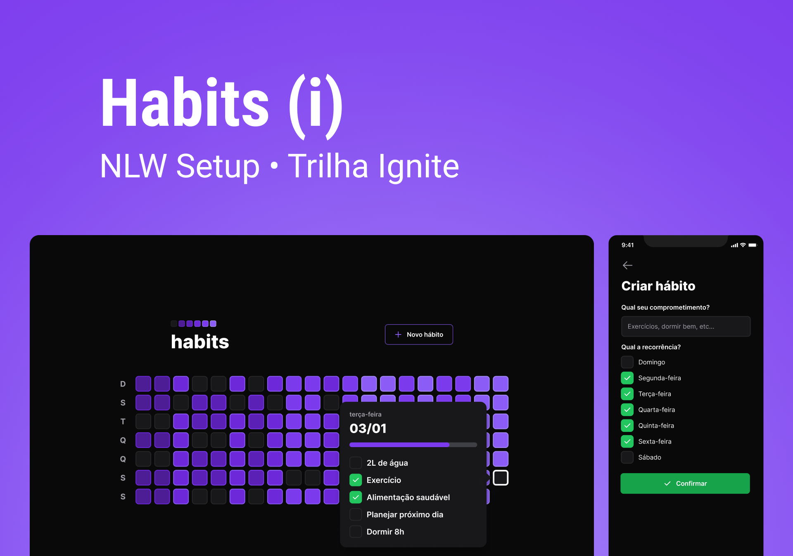
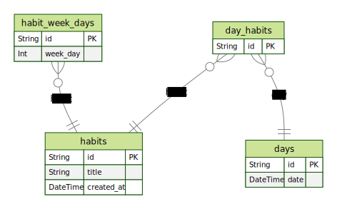

<h1 align=center>

</h1>

#### Server commands

- Install dependencies
  `npm i`
- Run migrations
  `npm run prisma:migrations`
- Prisma Client
  `npx prima studio`
- Running the app
  `npm run dev`

##### Database Relationships

#### Web commands

- Install dependencies
  `npm i`
- Running the app
  `npm run dev`

#### Mobile commands

- Install dependencies
  `npm i`
- Running the app
  `npm start`